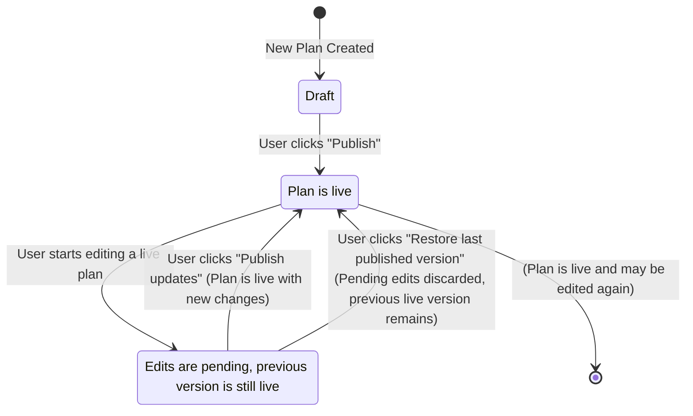

## What is a Plan?

A **Plan** is the commercial package that you offer to your customers. It defines exactly how you monetize your product by bringing together a specific **pricing model**, a set of **features**, and optional **add-ons**. This document provides a complete guide to the entire lifecycle of a plan, from creation and configuration to publishing and management.

---

## Viewing All Plans

To see a comprehensive list of all plans from all of your products, select the **Plans** sub-section from the **Product Catalog** in the left navigation pane. This global view is useful for managing your entire pricing structure in one place.

<Frame>

</Frame>

---

## Creating a Plan

You can create a plan from two primary locations:

1.  Directly from a **Product's detail page** to ensure it's linked to that specific product.
2.  From the global **Plans** tab in the main sidebar navigation.

This guide follows the recommended flow of creating a plan from within a product.

### Step 1: Start from the Product Page

After creating a product, you will see a prompt to create your first plan. Click the **"+ Create plan"** button.

<Frame>

</Frame>

### Step 2: Define the Plan Details

A "Create plan" modal will appear. Fill in the following details:

* **Plan name:** The public name for the plan (e.g., "Starter", "Pro", "Basic").
* **Identifier:** A unique ID for the plan, used to reference it in your code. This is auto-generated but can be overridden.
* **Description:** An optional description that appears on customer-facing elements like invoices and checkout pages.

<Tip>
  To create multiple plans quickly, keep the **"Create more"** toggle enabled. When you click "Create", the modal will reset, ready for the next plan's details.
</Tip>

<Frame>

</Frame>

### Step 3: Review Your Draft Plans

Once created, your plans will appear on the product's detail page in a **Draft** state. A draft plan is not yet live and can be safely configured before you publish it.

<Frame>

</Frame>

---

## Configuring a Plan

Click on any draft plan to navigate to its detail page. From here, you will set its price, add features, and associate add-ons.

<Frame>

</Frame>

### Step 1: Configure Pricing

Click the **Price** section to open the pricing configuration panel.

#### Free vs Paid Plans

At the top right of the pricing configuration, you'll see a **Free plan** toggle:

- **Free plan ON**: Users will not be charged. This is ideal for lead generation, freemium tiers, or starter plans. When enabled, you'll see a "Free plan active" confirmation.
- **Free plan OFF**: Configure paid pricing options as described below.

#### Billing Cycles

Select one or more billing cycles for your plan:

- **Monthly** — Recurring monthly charge
- **Yearly** — Recurring annual charge (often discounted)
- **3 Months** — Quarterly billing
- **One Time** — Single purchase, no recurring billing

For each selected billing cycle, enter the price in USD.

#### Free Trial

For paid plans, you can offer a free trial period:

1. Toggle **Free trial** on
2. Enter the trial duration in days (e.g., 7, 14, or 30)

Customers can use the plan without charge during the trial period. Billing begins automatically when the trial ends.

#### Regional Pricing

To offer localized prices in different currencies:

1. Click **+ Add Region** in the Regional Pricing section
2. Select a currency (e.g., United Arab Emirates Dirham, Euro, Indian Rupee)
3. Enter prices for each billing cycle in that currency
4. Click **Add Currency**

You can add multiple regional prices and edit or remove them at any time. This allows you to set specific prices for different markets rather than relying on automatic currency conversion.

#### Saving Your Pricing

Click **Save** to apply your pricing configuration. The plan will display your configured price options (e.g., "One Time: $239" or "Monthly: $10, Yearly: $100").

---

## Assigning Features to Plans

Once a plan's pricing is configured, the next step is to define the functionality that customers on this plan are entitled to use. In Kelviq, the combination of a **feature** and its specific configuration (e.g., on/off, a numeric limit) is called an **entitlement**.

On the plan's detail page, under the "Entitlements" section, you can see all the entitlements assigned to that plan.

<Frame>
   
</Frame>

### Adding Entitlements to a Plan

1.  Click the **"+ Add"** button under the "Entitlements" section of the selected plan.
2.  Search for the features you'd like to assign to the plan and select them from the list.
    <Tip>
      If a feature you need doesn't exist yet, you can type its name and select **"Create new feature"** directly from the dropdown menu without leaving the page.
    </Tip>
    <Frame>
     
    </Frame>
3.  Apply the relevant configuration for each selected feature (see Features Types below).
4.  Confirm the action by clicking the **"Add"** button. The features are now assigned to the plan.

### Features Types

Kelviq provides several ways to configure features to support various business models.

<CardGroup cols={3}>
  <Card title="Switch (Boolean)">
    Simple on/off access. Perfect for features that are either entirely included or excluded from a plan.
  </Card>
  <Card title="Customizable (Limit)">
    Access is governed by a numeric limit that you define.
  </Card>
  <Card title="Metered (Usage)">
    Access is tied to consumption, which can be reported as a pre-aggregated total or as raw events.
  </Card>
</CardGroup>

#### Switch / Boolean
This is the simplest entitlement. It acts as a toggle for a feature.

* **Allowed:** The customer has full access to the feature. For example, enabling "Premium Support" or "Dark Mode".
* **Not Allowed:** The customer does not have access. In a UI powered by Kelviq, the feature might appear disabled or be hidden behind an upsell prompt.

<Frame>
    
</Frame>

#### Customizable
This entitlement grants access to a feature up to a specific numeric limit you define.

You must enter a numeric value for the limit. For example, allowing up to `10` team members, a `500 MB` maximum file upload size, or `3` connected social media accounts.

You can also toggle **"Enable unlimited usage"**, which effectively grants infinite access to the feature for that plan.

<Frame>
  
</Frame>

#### Metered
A metered entitlement links a feature to its consumption, which is essential for usage-based billing.

* **Pre-aggregated usage:** Your application is responsible for counting usage and reporting the total to Kelviq periodically. Good examples include total `GB of storage used`, the number of `active projects` in an account, or the `minutes of video rendered`.
* **Raw events:** Your application sends individual event records to Kelviq (e.g., an event for each API request), and Kelviq calculates the total usage.

When configuring a metered entitlement, you can grant unlimited usage or set a specific limit. You can also define if the **usage count should reset** each billing period.

The most critical setting for a metered limit is **Limit Enforcement**. This is controlled by a toggle labeled **"Hard Limit (disable usage at zero balance)"**. The state of this toggle determines what happens when a customer consumes all of their allowance. By default, this toggle is **ON** (Hard Limit enabled).

| Toggle State for "Hard Limit" | Effective Behavior | Description                                                                                                                               | Customer Experience                                                                                                                               | Use Case Examples                                                                                                                             |
| :------------------------------------------------------------ | :----------------- | :---------------------------------------------------------------------------------------------------------------------------------------- | :------------------------------------------------------------------------------------------------------------------------------------------------ | :-------------------------------------------------------------------------------------------------------------------------------------------- |
| **ON (Default)** | **Hard Limit** | Access **is** blocked when the usage limit is reached (i.e., balance is zero). Kelviq will deny further attempts to use the feature.        | The customer is stopped from further usage and is typically shown a message prompting them to upgrade their plan or purchase more units to continue. | Controlling costs strictly, protecting critical resources, ensuring users do not exceed prepaid allowances without an explicit top-up or upgrade. |
| **OFF** | **Soft Limit** | Access is **not** blocked when the usage limit is reached. Usage can go into a negative balance or accrue as overage.                       | The customer can continue using the feature without interruption. This overage can be tracked for insights, to encourage an upgrade, or billed separately if an overage pricing model is configured. | Promoting user growth, avoiding service disruption for non-critical features, or implementing a pay-as-you-go overage model on top of a base allowance. |

<Frame>

</Frame>

### Defining the Entitlement Order

You can reorder entitlements to highlight your most important features first. In the "Entitlements" section of a plan, use the drag-and-drop handle on the left of each entitlement row to change the order.

<Frame>

</Frame>

### Removing Entitlements from a Plan
1.  On the plan's detail page, find the entitlement you wish to remove in the "Entitlement" list.
2.  Click the **three-dot menu icon** on the right side of the Entitlement's row.
3.  Select the **"Remove"** action from the dropdown menu.
4.  A confirmation dialog will appear. Click **"Remove"** to permanently remove the entitlement from the plan.

<Frame>
     
</Frame>

---
## Publishing and Managing Plans

This section guides you through the final steps of the plan lifecycle: making your plans live and managing all subsequent updates.

### Publishing a Plan

After a plan has been fully configured with its pricing, features, and entitlements, it remains in a **Draft** state. To make it available for new customer subscriptions, you must publish it.

1.  Navigate to the draft plan you want to make live.
2.  Click the **"Publish"** button, typically located in the top-right corner of the plan details page.
3.  A confirmation dialog will appear. Review the summary and confirm the action.

The plan is now live and can be integrated into your pricing tables and checkout flows.

<Frame>
     
</Frame>

### Editing Published Plans

One of the core strengths of Kelviq is the ability to make rapid changes to live plans without requiring engineering resources. This allows your product and growth teams to iterate on your pricing and packaging quickly.

When you publish an update to a plan, you can decide how the changes are applied:

* **For New Customers Only:** This is the standard for most pricing changes. Any customer who subscribed before this update will remain on their original plan and price. All new subscribers will get the updated plan.
* **For New AND Existing Customers:** This is ideal for additive changes that benefit all users. For example, when you add a valuable new feature to a plan, you can roll it out to every existing subscriber on that plan simultaneously.

#### Making and Publishing Changes

1.  To edit a live plan, navigate to the side panel in **Product Catalog > Plans**.
2.  Click the **three-dot menu icon** on the relevant plan and select the **"Edit"** action.

    <Frame>
     
    </Frame>

3.  Apply any changes to the plan's pricing, features, or other details.
4.  Once a change is made, the plan will have unpublished updates. Kelviq clearly indicates this with an **"Unpublished changes"** badge and a **yellow border** around the plan details section.

5.  To make your changes live, click the **"Publish updates"** button in the top corner of the page. This will open a dialog where you can confirm the changes and choose how to roll them out.

    <Frame>
     
    </Frame>

#### Restoring a Previous Version
If you make a mistake or wish to discard your unpublished changes, you can easily revert to the last published version.

1.  On a plan's detail page that has unpublished changes, click the **three-dot menu icon** located next to the "Publish updates" button.
2.  Select the **"Restore last published version"** option from the dropdown menu.

    <Frame>
        
    </Frame>

3.  A confirmation modal will appear, asking if you are sure. Click **"Restore version"** to confirm the action.

All of your pending changes will be discarded, and the plan will instantly revert to its last live state.

<Frame>
    
</Frame>

#### Visualizing the Plan Lifecycle

The lifecycle of a plan involves several key states, from its creation as a draft to being published and subsequently updated. The following diagram illustrates these transitions:

